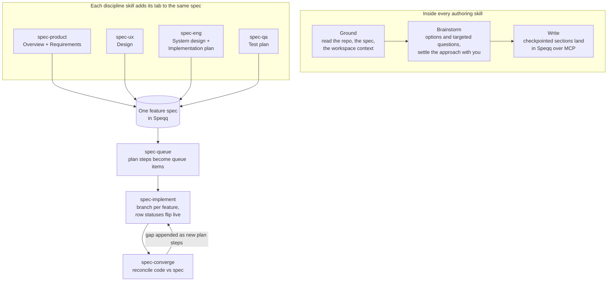

# Speqq Spec-Kit

**Spec-driven development for coding agents — with every spec living in Speqq, not in loose markdown files.**

Speqq Spec-Kit is a set of sixteen [Agent Skills](https://agentskills.io) (`SKILL.md`, the open cross-agent standard) that turn Claude Code, Codex CLI, Cursor, or Gemini CLI into a spec-driven planner. It follows the lineage of GitHub's spec-kit with one fundamental difference: every artifact lands in a Speqq workspace over MCP — live collaboration, a real work queue, row-level execution status. No `specs/` directory. No state files. Zero local state.

## What spec-driven development in Speqq means

Spec-driven development flips the usual order: instead of prompting an agent and reviewing whatever comes back, you settle intent first — a spec with testable requirements — and the agent builds from that. Spec-Kit keeps that discipline but moves the spec out of the repo. Each one is a live document in a Speqq workspace: an Overview anyone can read, and a Requirements table where every capability is a plain testable statement (no user stories) with Given/When/Then acceptance criteria as child rows. Product managers read, edit, and prioritize the same document the agent writes. One source of truth, and it is not buried in a git branch.

Every discipline adds its own tab to that same spec. The Design tab is grounded in your repo's actual design system — the components, tokens, and treatments the agent read in your code this session, not generic patterns — and specifies each screen in all four data states: loading, empty, error, success. Engineering adds a system design with natively rendered mermaid diagrams and a milestone-by-milestone plan; QA adds test cases traced back to each requirement by its exact title. Nothing lands without your checkpoint, and only clean, present-tense prose survives — options, notes, and brainstorms stay in the conversation.

For engineers, the payoff is zero local state and a live dashboard. There is no `specs/` folder to keep merged, no `tasks.md` to go stale. When the agent implements, it works branch-per-feature and flips each requirement row's status in real time — `in_progress` when it starts a step, `done` when the repo's own gates pass — so the spec doubles as the progress dashboard while the code lands in git. When code and spec drift, a convergence pass reconciles them: genuinely-done rows flip `done`, and the remaining gap is appended to the plan as concrete new steps.

## Get started

### 1. Install the plugin

One install delivers the skills, the session hooks, and the Speqq MCP registration. Claude Code:

```bash
claude plugin marketplace add speqqai/spec-kit
claude plugin install spec-kit@speqq
```

Codex CLI:

```bash
codex plugin marketplace add speqqai/spec-kit
codex plugin add spec-kit@speqq
```

Start a new session after installing; on Codex, approve the hooks once with `/hooks`. For Cursor, Gemini CLI, or a folders-only install, use `npx skills add speqqai/spec-kit` via [skills.sh](https://skills.sh) — see [docs/installation.md](docs/installation.md).

### 2. Sign in to Speqq

Every skill reads and writes through the Speqq MCP server the plugin just registered — no token needed. Run `/mcp` in a Claude Code session, or `codex mcp login speqq` on Codex, and finish the browser login. The bearer-token alternative for service accounts is in [docs/connect-speqq.md](docs/connect-speqq.md).

### 3. Write your first spec

Ask your agent to spec a feature:

> Spec this feature: users can export a report as a PDF

`spec-product` picks it up: it grounds in your repo, asks a few targeted questions (one at a time, five max), checkpoints each section with you, then creates the spec in your Speqq workspace — Overview plus Requirements with acceptance criteria. From there the other skills add their tabs to the same spec: "design this feature" (spec-ux), "write the system design" (spec-eng), "write the test plan" (spec-qa) — then "queue the work" and "implement the spec."

## The eight authoring and execution skills

| Skill | What it writes | When to use it |
| --- | --- | --- |
| `spec-product` | The feature spec itself: an Overview page plus a Requirements table — testable capability statements (no user stories) with Given/When/Then acceptance criteria | Start a feature spec; capture what a feature does and for whom |
| `spec-ux` | A Design tab: screens, the four data states (loading / empty / error / success), interactions, and flows — grounded in the repo's real design system | The feature needs its UX specified |
| `spec-eng` | System design and Implementation plan tabs: architecture and sequence diagrams in mermaid (rendered natively in Speqq), data model, contracts, failure modes, and a milestone plan of narrow steps | The feature needs an architecture and a build plan |
| `spec-qa` | A Test plan tab: enumerated TC cases traced to each requirement by title, each honestly labeled automated or manual against what the repo can actually run | The feature needs test coverage mapped |
| `spec-fix` | A bug spec: Overview, Root cause, Fix, Validation — evidence-bounded, with unproven causes labeled as hypotheses | Spec a defect and its durable fix |
| `spec-implement` | Code on a feature branch — plus live row status flips in the spec as each step lands, so the spec is the progress dashboard | Execute a spec's Implementation plan, or resume one |
| `spec-converge` | Status flips for genuinely-done rows and appended plan steps covering the remaining gap — append-only, never rewriting finished prose | Check drift: reconcile what the code does against what the spec says |
| `spec-queue` | Deduplicated queue items — one per plan step, priority-labeled, traceable back to the spec | File a plan's work into the Speqq workspace queue |

## Setup and grounding

| Skill | What it writes | When to use it |
| --- | --- | --- |
| `spec-setup` | The connection itself: the harness MCP registration (OAuth first — no token), the session hook entries, and — only if you want the token-fed extras — the `~/.speqq/credentials` skeleton you paste into yourself | Connect Speqq for the first time; install or repair the session hooks |
| `spec-update` | The update itself: detects the install channel (plugin or folders), checks installed vs latest, runs the update, and names the reconcile steps — new session, `/hooks` re-trust on Codex when hooks changed | Update the kit, or check whether a newer version exists |
| `spec-init` | The spec shell, the matching queue item, the link between them, priority, and `in_progress` — one act, so none of it gets forgotten | Start something new and get it properly set up |
| `spec-research` | Findings worth keeping, appended to the spec's memory as they are found | Get up to speed before specifying: what is true today, what is already decided, what is open |

`spec-research` runs `spec-init` first when no spec exists — findings need a memory to land in. `spec-setup` also carries the session hooks: an optional hook pack for Claude Code and Codex CLI that injects connection status, workspace orientation, and your active work before you type anything — see [docs/hooks.md](docs/hooks.md).

## The four session skills

A spec keeps a **MEMORY.md**: an append-only log of what happened while it was built, one line per entry, written by agents as work happens. It exists because a context window ends — sometimes deliberately, sometimes not — and anything not recorded is lost with it. These four are how a session opens, closes, and picks back up.

| Skill | What it writes | When to use it |
| --- | --- | --- |
| `spec-start` | The first line in a spec's memory, naming what this run is going after; marks the queue item in progress | Begin work on a spec that has not been worked yet |
| `spec-pause` | One line describing where the work stands — what landed, what did not and why, what is next — plus honest row statuses | Stop for now, so the next session starts from a record instead of from commits |
| `spec-snippet` | One line, on demand, in your own words | Record something as you go: a decision, a dead end, a surprise |
| `spec-resume` | Nothing — it is read-only | Come back to a spec: where it stopped, what was already tried, what is next |

The log is append-only in the strict sense: `spec_memory_append` is the only way in, it stamps the time itself, existing lines are never edited, and the generic markdown write tools refuse a memory outright. That is what makes it trustworthy under interruption.

## The workflow

Every authoring skill runs the same three-phase loop — ground in the real repo, brainstorm and settle the approach with you, then write checkpointed sections to Speqq. The discipline skills compose onto one spec; the execution skills work from it.



`spec-fix` runs the same ground → brainstorm → write loop for defects, producing its own bug spec (Overview / Root cause / Fix / Validation) in the same workspace.

## Zero local state

The skills write nothing to your machine except the deliverable itself — the branches and commits `spec-implement` produces.

- **No `specs/` directory.** Specs live in Speqq, where your team already works.
- **No task or progress files.** Requirement rows are the ledger; status flips replace `[x]` markers.
- **No pointer files.** The active spec resolves from Speqq-side data — the queue item you picked, the spec list, the current git branch matched against row branch links — never from a file on disk.
- **Drafts never touch disk.** Grounding notes, options, and clarification queues live in conversation context; only clean, final prose lands in the spec.

The result: resume work from any machine or session, nothing to merge or go stale, and teammates watch progress live because the spec is the dashboard.

## Supported harnesses

All four install with the same command. The MCP server is `https://speqq.com/mcp` everywhere; only the way you register it differs.

| Harness | Register the Speqq MCP server |
| --- | --- |
| Claude Code | `claude mcp add --transport http speqq https://speqq.com/mcp --header "Authorization: Bearer <token>"` |
| Codex CLI | MCP server entry in `config.toml` |
| Cursor | MCP server entry in `mcp.json` (project or global) |
| Gemini CLI | MCP server entry in the settings file |

## Roadmap

Planned, not yet shipped:

- **Deeper hook packs** — enforced status sync, phase auto-commit, and a branch guard. Session context injection already ships: `spec-setup` carries session hooks for Claude Code and Codex CLI — see [docs/hooks.md](docs/hooks.md).

## Documentation

- [docs/installation.md](docs/installation.md) — installing, updating, and removing the skills, per harness
- [docs/connect-speqq.md](docs/connect-speqq.md) — connecting the Speqq MCP server, per harness, with troubleshooting
- [docs/hooks.md](docs/hooks.md) — the session hooks: what they inject, the invariants, the credentials bridge
- [docs/workflow.md](docs/workflow.md) — the spec-driven workflow end to end

## License

MIT
