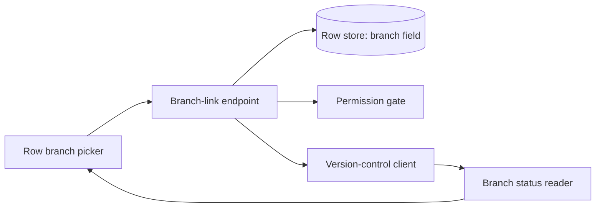
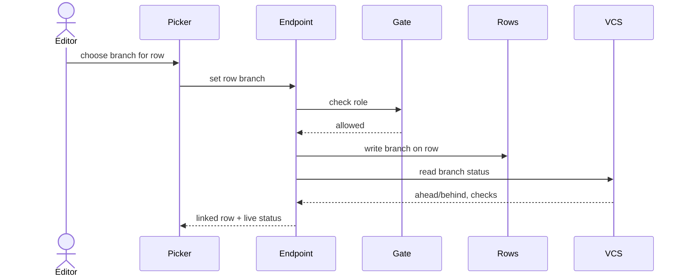

# spec-eng

Owns two page tabs on one feature spec: **System design** and **Implementation plan**. Every artifact lands in Speqq over MCP. Nothing lands anywhere else.

## Preflight — before any other step

1. **Confirm Speqq MCP is connected.** You need `list_workspaces`, `spec_list`, `spec_read`, `spec_create`, `tab_create_page`, `spec_markdown_tab_update`, `spec_markdown_tab_append`, and `get_context`. If the Speqq tools are not available, STOP before writing anything: tell the user, walk them through connecting the Speqq MCP server for their harness, and resume only once it is connected. Never fail silently. Never fall back to local files.
2. **Resolve the workspace.** Call `list_workspaces` before any other Speqq call. One workspace: use it. Several: ask the user which one. Every subsequent call uses that `workspace_id`.
3. **Zero local state.** This skill never creates or modifies any file in the user's repo or machine — no notes files, no scratch markdown, no design drafts on disk. Grounding and brainstorm working notes live in agent context only and never enter the spec.

## Flow: Ground → Brainstorm → Write

Only the write phase touches spec content. Each stage has an exit condition — do not advance until it is met.

### Stage 1 — Ground

Read the actual working tree with your own file tools (read, grep, glob). Do not trust an indexed or external code graph — the checkout is the source of truth.

Gather, in this order:

1. **Workspace context.** Call `get_context` for product and workspace grounding. Treat it as optional grounding: if it is empty or missing, proceed from the repo alone.
2. **Repo standards.** The repo's own instruction and convention documents — an agent/contributor instructions file, style or architecture notes, decision records — wherever they live in this repo. These are design gates, not background reading: the design you write must not violate them.
3. **Technical context**, derived only from code that is actually there. Fill every entry; mark anything you cannot determine from the repo as `NEEDS CLARIFICATION`:
   - Language and version
   - Primary dependencies and frameworks
   - Storage layer (what actually persists data, and how it is accessed)
   - Testing setup and conventions
   - Target platform and project type (library, CLI, service, web app, mobile...)
   - Module boundaries and layering
   - Permission/auth model
   - Error-handling conventions (throw vs. surface vs. retry, as practiced in this code)
   - Performance goals, constraints, and scale, where the feature makes them relevant
4. **The feature spec.** There is no spec search over MCP: call `spec_list` and filter titles client-side to find the feature spec. Reuse an existing spec for the feature — never create a duplicate. If found, `spec_read` it and copy the exact requirement titles and each requirement's status. Row status is a fixed enum (`new`/`backlog`/`todo`/`in_progress`/`done`/`cancelled`): a requirement with status `done` is shipped/Live; anything else is planned. If no spec exists, the requirement titles get settled with the user in Stage 2.

**Exit:** You can name the real stack, module boundaries, data layer, permission model, and error conventions from files you read — and every technical-context entry is either filled or carries a `NEEDS CLARIFICATION` marker.

### Stage 2 — Brainstorm

**Resolve every `NEEDS CLARIFICATION` first.** For each marker, run a targeted investigation — more repo reading, or a direct question to the user. Record each resolution in working notes as: Decision (what was chosen), Rationale (why), Alternatives considered (what else was evaluated). No marker may survive into the write phase.

**Then settle the open design decisions.** For each decision the repo does not already settle (where a link or field lives, when a status is read, where a permission gate sits), enumerate the realistic options and the single tradeoff that separates them. Settle on the option that fits the patterns you read in Stage 1.

**Standards gate.** Check the settled design against the repo standards and workspace context from Stage 1. Every violation must be either redesigned away or explicitly justified to the user — name the violation, why it is needed, and why the simpler compliant alternative is insufficient. Unjustified violations block the write phase. Justified ones are recorded in Alternatives considered. Do not introduce a new dependency unless the repo lacks the capability and the user agrees; say why the existing path does not fit.

**Surface the approach.** Present the settled design to the user in brief — the shape, the key decisions, the tradeoffs that decided them — and get agreement before writing anything to Speqq.

**Exit:** User agrees on the approach; zero unresolved markers; requirement titles are fixed (copied from the spec, or settled with the user).

### Stage 3 — Write

Write each section as clean, final, present-tense production prose. No filler, no diary, no TODO. Present each tab to the user and checkpoint before writing the next. Reference every requirement by its exact plain title so all discipline skills map back to one source of truth.

Before the first write, re-run the standards gate against the drafted design. If the draft introduced a violation, return to Stage 2.

#### Tab 1 — System design

A real architecture document, in this order:

1. **Context, goals, non-goals** — the problem this feature solves, what the design must achieve, and what it explicitly does not do.
2. **Architecture overview** — a paragraph plus a component mermaid diagram (`flowchart`).
3. **Components and responsibilities** — each component, what it owns, and the requirement title it serves.
4. **Data model and schema** — entities, fields, types, keys, relationships, and state transitions where they exist, expressed in the repo's actual storage layer as read during grounding — not a generic schema notation. Carry validation rules that derive from the requirements.
5. **Interfaces and contracts** — the endpoints, functions, events, or messages between components, with their shapes and error signals. Use the contract form native to the project type: endpoints for a service, command schemas for a CLI, public API for a library, UI contracts for an application. Skip external-interface framing entirely if the feature is purely internal.
6. **Key flows** — one mermaid `sequenceDiagram` per important flow.
7. **Dependencies and framework choices** — the libraries, services, and framework primitives this design relies on, named from what the repo already uses. A new dependency appears here only with the user's agreement from Stage 2, alongside why the existing path does not fit.
8. **Failure modes** — what breaks, how the system detects it, and how it responds (throw vs. surface vs. retry) consistent with the repo's own error conventions.
9. **Security and permissions** — who may do what, where the gate is enforced, and how the permission requirement is honored.
10. **Alternatives considered** — the options rejected in brainstorm and the tradeoff that decided each, plus any justified standards deviations.
11. **Requirement traceability** — a table mapping each requirement (by exact plain title) to the components that satisfy it. Every requirement appears; none is left unmapped.

Illustrative structure only — mirror it, not its stack:

Component diagram:



Key flow:



Traceability:

| Requirement | Satisfied by |
| --- | --- |
| User can link a table row to a GitHub branch | Row branch picker → branch-link endpoint → row store branch field |
| A linked row shows its branch live status | Status reader reads the branch live on render → status shown on the row |
| Only editors and admins can change a row branch | Permission gate on the branch-link endpoint |

#### Tab 2 — Implementation plan

Branch on requirement lifecycle.

**Shipped requirements** (status `done`) — document the current build state: the modules, endpoints, and schema that already deliver the requirement, so the plan reflects what exists rather than proposing to rebuild it.

**Planned requirements** — break work into milestones of narrow, reviewable steps.

Decomposition rules:

- **One milestone per planned requirement**, in priority order. The highest-priority requirement's milestone is the MVP: complete it first, validate it, and it stands on its own.
- **A foundational milestone comes first only when blocking prerequisites are real** — shared schema, a gate, or scaffolding that every later milestone needs. Keep it minimal; it blocks everything behind it.
- **Each milestone is independently verifiable.** Completing it delivers observable behavior for its requirement without waiting on later milestones. Each milestone ends at a checkpoint the user can validate.
- **Within a milestone, order steps by dependency:** data model → domain logic/services → interfaces/endpoints → UI/integration.
- **Each step is narrow** — reviewable in one sitting. If a step touches many unrelated surfaces, split it.
- **Steps with no shared surfaces and no dependency between them can proceed in parallel** — say so in Depends on.

Each step carries exactly:

- **Changes** — what the step alters.
- **Surfaces** — the specific files, modules, or contracts it touches, by real path or name from grounding. No vague surfaces.
- **Depends on** — prior steps or external prerequisites (or "none — parallel with N.M").
- **Done when** — the observable condition that proves the step is complete. Behavior, not "code merged."

Map each step to the requirement title(s) it delivers.

Validate completeness before presenting the tab: every planned requirement is delivered by at least one milestone; every step has real surfaces and an observable done-when; the dependency order is sound with no forward references; no vague steps.

Illustrative skeleton:

```text
Current build state
- "User can link a table row to a GitHub branch" — Live. Picker + branch-link
  endpoint + branch field on the row store.

Milestone 1 — Live branch status  (delivers "A linked row shows its branch live status")
  Step 1.1
    Changes    Add a status reader that reads the branch on row render.
    Surfaces   Version-control client; row read path; status display on the row.
    Depends on Existing branch field.
    Done when  A linked row shows ahead/behind and check state from the live source.

Milestone 2 — Role gate  (delivers "Only editors and admins can change a row branch")
  Step 2.1
    Changes    Enforce role on the branch-link endpoint; hide the picker for viewers.
    Surfaces   Branch-link endpoint; picker visibility.
    Depends on Milestone 1.
    Done when  A viewer cannot change a row branch via UI or endpoint.
```

## Writing to Speqq

Write over MCP only — never local files. Do not paste grounding or brainstorm notes; only final prose lands.

**All tab and row writes to one spec are strictly sequential.** Issue one call, wait for it to return, then issue the next. Parallel writes to the same spec collide and silently drop content.

The sequence:

1. **Locate or create the spec.** `spec_list`, filter titles client-side (there is no spec search over MCP). Reuse the existing feature spec — never duplicate. If it exists, `spec_read` it to pull the exact requirement titles and statuses (if not already done in Stage 1). If it does not exist, `spec_create` with the feature title **only** — the Overview belongs to the spec-product skill — and use the requirement titles settled with the user. Spec titles are commit-form: `feat: X`, `feat(scope): X`, or `fix(scope): X`.
2. **System design tab.** `tab_create_page` on that spec, title `System design`, with the full Tab 1 markdown. Wait for it to return.
3. **Checkpoint** with the user on the System design tab.
4. **Implementation plan tab.** `tab_create_page` on the same spec, title `Implementation plan`, with the full Tab 2 markdown. Wait for it to return.
5. **Checkpoint** with the user.

**Updating an existing tab.** If a `System design` or `Implementation plan` tab already exists, update it — do not create a duplicate. `spec_markdown_tab_update` is PATCH-based: it takes a `patches` array of `{old_str, new_str}` edits, and each `old_str` must occur exactly once in the tab's current markdown. Never assume full-document replace. An empty `old_str` is allowed only to initialize a currently empty tab. For a larger rewrite, patch section by section with a unique anchor per patch — batch the section patches into one call's `patches` array rather than issuing parallel calls. For pure additions at the end, use `spec_markdown_tab_append`.

**Mermaid.** Diagrams are fenced ```mermaid blocks inside the page markdown — write valid mermaid; the product renders and validates it. If a write returns a mermaid-specific error, fix the mermaid source and retry the same markdown write.

**Enums are fixed.** Spec status: `draft`/`in_review`/`rejected`/`approved`/`queued`/`building`/`released`. Row status: `new`/`backlog`/`todo`/`in_progress`/`done`/`cancelled`. Review status: `draft`/`in_review`/`approved`. This skill sets none of them — it only reads row status to branch shipped vs. planned. Never invent a status value; a workflow label that does not map belongs in description text.

## Voice and quality checklist

Verify every line before declaring done:

- Present tense, plain, production documentation. No filler, no marketing, no TODO or diary.
- Lean. Cut every sentence that does not carry a design decision or contract.
- Codebase-agnostic sourcing: every stack, library, store, and rule is named from what you read in this repo — never assumed or generic.
- Every requirement is referenced by its exact plain title; the traceability table covers all of them.
- Diagrams render: each is a fenced ```mermaid block with valid syntax.
- Data model, interfaces, failure handling, and permissions match the repo's real patterns; deviations were justified to the user and recorded.
- Implementation steps are narrow and reviewable, each with Changes / Surfaces / Depends on / Done when, each mapped to a requirement; every planned requirement has a milestone; shipped requirements are documented as current build state, not re-planned.
- All `NEEDS CLARIFICATION` markers were resolved before writing; none appear in the spec.
- Tabs written sequentially, existing tabs patched not duplicated, and grounding/brainstorm notes never entered the spec.
- No file was created or modified on the user's machine.
